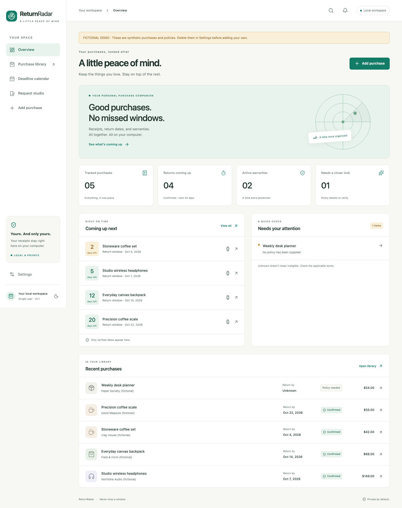
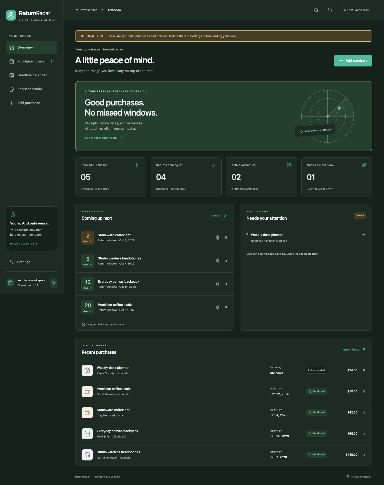
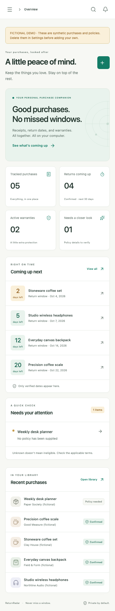
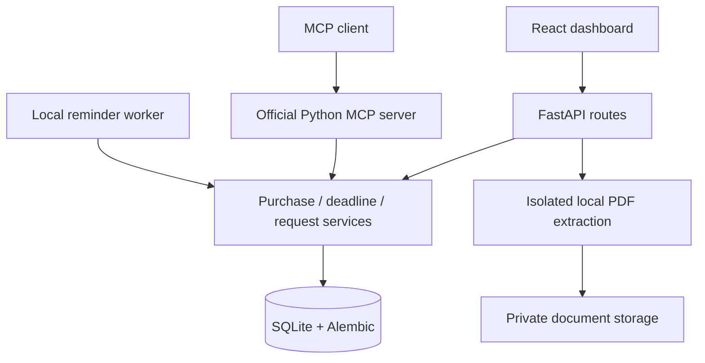

# ReturnRadar

**Never miss a return, refund, or warranty deadline again.**

A private, open-source home for your purchases. Upload a receipt, review the
details, record the applicable terms, and see what needs your attention.

**Use the hosted beta: [Open ReturnRadar](https://returnradar.tss-99.chatgpt.site)**

Sign in with ChatGPT, add a purchase or PDF receipt, and verify the actual terms.
Your account works across devices and does not need your computer to stay on.
Read the [user guide](https://returnradar.tss-99.chatgpt.site/guide).
The owner can see aggregate usage in the [private dashboard](https://returnradar.tss-99.chatgpt.site/admin).

Version 0.2 adds managed hosting, private accounts, cloud receipt storage,
remote authenticated MCP tools and owner analytics. See [hosted operations](docs/hosted.md)
and [hosted source](hosted/README.md). The hosting platform provisions a personal
plugin; a public ChatGPT directory listing still requires separate approval.
No paid resources or automatic billing were enabled.

The original local application remains available below. Its SQLite data stays
on your computer and is separate from hosted accounts. Neither version uses a
paid model/API. A date is **confirmed** only when its inputs are user verified;
merchant eligibility and approval are separate.



<details><summary>Dark theme and mobile screenshots</summary>





</details>

Screenshots are captured from the running application by browser tests. Every
record pictured is fictional and the demo banner is visible. A new database
starts empty.

## What you can do

- Upload text-based PDF receipts (10 MB, 50 pages maximum), review extraction
  evidence and confidence, correct suggestions, and attach the original receipt.
- Create, edit, delete, search, filter and paginate purchases. Record returned,
  refunded, kept, warranty claimed, or archived status.
- Track return and warranty windows from the stated purchase date, delivery
  date, specific start date, or explicit cutoff. Unknown inputs stay unknown.
- See confirmed dates in a timeline, and uncertain policies in an attention list.
- Receive local in-app reminders at configurable offsets, with catch-up and
  duplicate prevention. The backend must be running to process them.
- Prepare editable return, refund follow-up, warranty and replacement drafts.
  Copy or download them; the app never sends mail.
- Export CSV/JSON, download a receipt-inclusive backup, and delete local data.
- Use eight MCP tools through the official Python MCP SDK, with shared business
  logic and structured results. Switch between light and dark themes.

## Local application quick start

Requirements: **Python 3.11+**, **Node.js 22.12+** (or a current supported Node
release), npm, and Git. Dependency downloads need internet access; everyday
local use does not. Windows users can use PowerShell or WSL.

```bash
git clone https://github.com/TSS99/returnradar.git
cd returnradar
python3 -m venv .venv
source .venv/bin/activate
python -m pip install -r requirements-dev.lock
python -m pip install --no-deps -e .
cd frontend
npm ci
cd ..
```

On Windows, use `python` instead of `python3` and activate with
`.venv\Scripts\Activate.ps1`. The runtime-only lock is `requirements.lock`;
`requirements-dev.lock` additionally installs test and security tools.

Start the backend from the repository root:

```bash
source .venv/bin/activate
python -m uvicorn backend.app.main:app --host 127.0.0.1 --port 8000
```

In a second terminal, start the frontend:

```bash
cd returnradar/frontend
npm run dev
```

Open **[http://127.0.0.1:5173](http://127.0.0.1:5173)**. The frontend proxies
`/api` to the loopback backend. Interactive API documentation is at
[http://127.0.0.1:8000/docs](http://127.0.0.1:8000/docs).

Alembic automatically migrates the SQLite database on backend/MCP startup.
Data defaults to `private_data/` in the repository root, independent of your
working directory. To choose another private folder, set
`RETURNRADAR_DATA_DIR=/absolute/path` for **both** the backend and MCP client.
The app does not automatically read `.env` files.

## Try it with fictional data

1. On the empty overview, choose **Explore fictional demo**. This explicitly
   inserts five fictional purchases and synthetic policy cutoffs.
2. Browse the library, details and deadline calendar. No demo is loaded by default.
3. Delete the demo in Settings before using your own data.
4. Choose **Add purchase → Upload receipt**, select
   [`sample_data/synthetic-receipt.pdf`](sample_data/synthetic-receipt.pdf), and
   correct any suggestions. This PDF is permanently dated fictional test data;
   its return deadline may already be past when you try it.
5. Check the receipt details and the applicable policy separately. Save, open
   the purchase, then choose **Prepare a request**. Review the draft yourself.

To test a reminder immediately without changing your clock, manually enter a
fictional purchase with a verified explicit cutoff today. In Settings choose
**Check due reminders**. Reminders run at 9 am in the purchase timezone; before
that time, yesterday's offsets can still be due. See the automated reminder
tests for deterministic examples.

## MCP connection

MCP runs over local **stdio**, using the same SQLite data and application
services as the web app. It does not need the HTTP backend running for CRUD.
The reminder worker still needs the backend or a scheduled one-shot run.

```bash
source .venv/bin/activate
python -m scripts.mcp_smoke
python -m scripts.local_mcp_config
```

The first command launches the real server and tests a read-only call. The
second prints a local client configuration with your installation's absolute
Python executable and data directory. Add that configuration to a stdio-capable
MCP client, then ask it to list purchases or confirmed deadlines within seven days.

The portable plugin is in [`plugin/`](plugin/); install the Python package
first so `returnradar-mcp` is available on the client's PATH. Build the ZIP with
`python -m scripts.package_plugin`. Desktop launchers often need the generated
absolute-path configuration rather than relying on shell activation.

ChatGPT web cannot directly launch this local stdio process. Public distribution
needs a separately hosted, authenticated HTTPS MCP service and platform review.
No public endpoint or registration is claimed. See [MCP setup](docs/mcp-setup.md).

## Testing and quality checks

From the repository root, with the virtual environment active:

```bash
python -m pytest -q
ruff check .
ruff format --check .
bandit -r backend/app mcp_server -q
pip-audit
python -m scripts.mcp_smoke
cd frontend
npm run build
npm run format:check
npm audit --audit-level=low
npx playwright install chromium
npm run test:e2e
```

Browser tests start their own backend and frontend on ports 8000 and 5173:
stop your regular servers first. Their database and uploaded test receipts
are isolated under ignored `frontend/.cache/e2e-private_data/`. Screenshots
are written to `docs/screenshots/`. Test data is always synthetic.

GitHub Actions runs backend tests, Ruff, Bandit, dependency audits, TypeScript,
the frontend production build, and the real browser journey. The suite includes
PDF content/type/size validation, missing and ambiguous dates, purchase CRUD,
deadline bases, leap years, timezone/DST boundaries, reminder catch-up,
idempotency, structured MCP input validation and a real stdio connection,
export, cascade deletion, and local browser-origin protection.

## Architecture



Python: FastAPI, Pydantic, SQLAlchemy, Alembic, pypdf, python-dateutil, MCP SDK,
pytest and Ruff. Web: React, TypeScript, Vite, Tailwind CSS and Lucide.
Monetary amounts are exact decimal strings in storage and API responses.

```text
backend/app/      API, core, database, models, schemas, services, PDF worker
backend/migrations/  Versioned Alembic migrations
backend/tests/   Synthetic unit and integration tests
frontend/src/    Components, pages, hooks, API client, types and theme
frontend/tests/  Browser user journeys
mcp_server/      Eight tools reusing backend services
plugin/          Portable manifest, Codex fallback, MCP config and skill
scripts/         MCP smoke/config, reminder worker, plugin packaging
sample_data/     Clearly fictional receipt PDF and text
docs/            Architecture, API, setup, MCP, deployment, roadmap, screenshots
.github/         CI and issue forms
```

## Privacy, accuracy and limitations

Invoices stay local by default. There is no telemetry, paid API, model inference,
merchant scraping, or automatic email. An MCP client receives the records its
tools request; its own privacy terms apply to that information.

Documents are parsed as untrusted data in a bounded subprocess. Generated
filenames, content validation, restricted origins, loopback defaults, protected
document downloads, and CSV formula escaping reduce local risks. These controls
are **not multi-user authentication**. Keep the app off public interfaces.

Known v0.1 limits:

- Extraction recognizes explicit English labels; complex invoice tables often
  need manual entry. Image-only/scanned PDFs, PNG and JPEG OCR are unsupported.
- Ambiguous numeric dates remain unknown. Receipt fields are suggestions until
  reviewed; no merchant policy is inferred from its name.
- Only one return and one warranty policy per purchase. Use separate records
  for items with different policies. Calendar months clamp to the last valid day.
- A known warranty end without a verified start is labelled "end date confirmed",
  rather than assumed to be active coverage.
- Date-only cutoffs have no merchant-specific hour, holiday extension,
  inclusive-counting convention, or automatic eligibility assessment. Choose
  an explicit cutoff when exact merchant counting differs from start + duration.
- Local in-app reminders only; the computer/backend must be on. Catch-up reminders
  can report a deadline that has already passed. No desktop, push or email delivery.
- No account system, hosted endpoint, merchant return submission, refund
  confirmation, bank connection, or public plugin registration.
- Purchase and attachment data are not encrypted at rest. Use OS disk encryption.
  Downloaded backups need private storage. Automated backup restore is not included.
- Abandoned extraction previews are stored until discarded or all data is deleted.
  Deletion cannot guarantee forensic erasure or erase previously exported copies.

Read [PRIVACY.md](PRIVACY.md), [SECURITY.md](SECURITY.md), and
[deployment limitations](docs/deployment.md) before exposing anything remotely.

## Troubleshooting

| Symptom | What to check |
| --- | --- |
| Dashboard connection error | Backend on port 8000; frontend on 5173; use 127.0.0.1. |
| Port already in use | Stop the process on that port; browser tests require both ports free. |
| PDF rejected | Genuine unencrypted text PDF under 10 MB / 50 pages; try manual entry for scans. |
| Deadline stays unknown | Supply the applicable policy and required starting date. |
| Deadline says needs verification | Review both policy terms and extracted starting date. |
| No reminder | Enable reminders, check timezone, confirmed inputs, purchase status and 9 am schedule. |
| MCP shows an empty library | Use the same absolute `RETURNRADAR_DATA_DIR` as the backend. |
| Client cannot find server | Use `python -m scripts.local_mcp_config` for an absolute-path config. |
| SQLite locked | Avoid migrations/backup restore while other processes write; close them before maintenance. |

## Contribute

Small, well-tested accuracy and usability improvements are welcome. Start with
[CONTRIBUTING.md](CONTRIBUTING.md) and [AGENTS.md](AGENTS.md). Report bugs or
suggestions through the repository's issue forms; never attach private receipts.
Follow the [Code of Conduct](CODE_OF_CONDUCT.md).

The [roadmap](docs/roadmap.md) covers optional OCR/email, merchant integrations,
secure multi-user sync and eventual hosted MCP/public distribution. These are
future work, not current features.

MIT licensed. Development expenditure for this release: **INR 0**.
